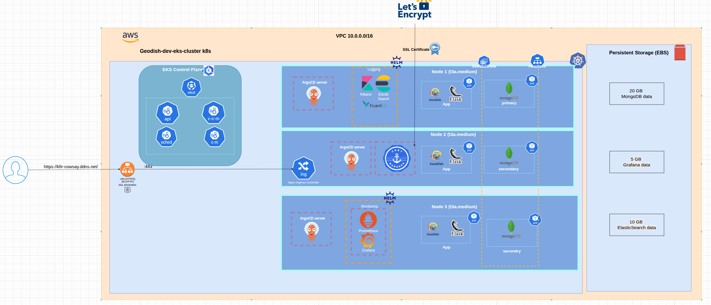

# GeoDish Infrastructure 🌍🍽️

> Terraform-based AWS EKS infrastructure for the GeoDish application - A global culinary discovery platform


## 📋 Table of Contents

- [Overview](#overview)
- [Architecture](#architecture)
- [Prerequisites](#prerequisites)
- [Quick Start](#quick-start)
- [Infrastructure Components](#infrastructure-components)
- [Terraform Modules](#terraform-modules)
- [Deployment](#deployment)
- [Post-Deployment](#post-deployment)
- [Monitoring & Logging](#monitoring--logging)
- [Cost Optimization](#cost-optimization)
- [Troubleshooting](#troubleshooting)
- [Related Repositories](#related-repositories)

## 🎯 Overview

This repository contains the complete Infrastructure as Code (IaC) for deploying the GeoDish application on AWS EKS. It provides a production-ready Kubernetes cluster with comprehensive monitoring, logging, and GitOps capabilities.

### Key Features

- ✅ **Fully Automated Deployment** - Single `terraform apply` to deploy everything
- ✅ **High Availability** - Multi-AZ deployment with auto-scaling
- ✅ **Security First** - Private subnets, security groups, encrypted storage
- ✅ **GitOps Ready** - ArgoCD for continuous deployment
- ✅ **Observable** - Complete monitoring stack (Prometheus, Grafana, ELK)
- ✅ **Cost Optimized** - Resource limits and auto-scaling for cost control

## 🏗️ Architecture



### Architecture Highlights

**AWS Infrastructure:**
- **VPC**: Custom VPC with CIDR 10.0.0.0/16
- **Subnets**: Private subnets across multiple AZs for enhanced security
- **EKS Cluster**: Managed Kubernetes 1.28 with 2-3 t3a.medium nodes
- **Storage**: EBS CSI driver for persistent volumes (MongoDB, Elasticsearch, Grafana)
- **Load Balancer**: AWS ALB for ingress traffic
- **SSL/TLS**: Let's Encrypt certificates via Cert-Manager

**Kubernetes Components:**
- **Control Plane**: Managed EKS control plane components (etcd, API server, scheduler, controller-manager)
- **Worker Nodes**: 2-3 t3a.medium instances in private subnets
- **GitOps**: ArgoCD for declarative application deployment
- **Ingress**: Nginx Ingress Controller with SSL termination
- **Monitoring**: Prometheus + Grafana for metrics and visualization
- **Logging**: ELK Stack (Elasticsearch + Fluentd + Kibana)
- **Database**: MongoDB Community Operator for data persistence

## 📦 Prerequisites

### Required Tools

```bash
# Terraform
terraform >= 1.5.0

# AWS CLI
aws-cli >= 2.0

# kubectl
kubectl >= 1.28

# Helm (optional, for manual operations)
helm >= 3.0

# jq (for JSON parsing)
jq >= 1.6
```

### AWS Requirements

- AWS Account with appropriate permissions
- IAM user/role with EKS, VPC, EC2, and IAM permissions
- AWS credentials configured (`~/.aws/credentials` or environment variables)
- S3 bucket for Terraform state (created manually)

### AWS IAM Permissions Needed

```json
{
  "Version": "2012-10-17",
  "Statement": [
    {
      "Effect": "Allow",
      "Action": [
        "eks:*",
        "ec2:*",
        "iam:*",
        "elasticloadbalancing:*",
        "autoscaling:*",
        "cloudwatch:*",
        "secretsmanager:*"
      ],
      "Resource": "*"
    }
  ]
}
```

## 🚀 Quick Start

### 1. Clone the Repository

```bash
git clone https://github.com/kfiros94/geodish-infrastructure.git
cd geodish-infrastructure
```

### 2. Create S3 Backend (First Time Only)

```bash
# Create S3 bucket for Terraform state
aws s3 mb s3://geodish-terraform-state-dev --region ap-south-1

# Create DynamoDB table for state locking
aws dynamodb create-table \
  --table-name geodish-terraform-locks \
  --attribute-definitions AttributeName=LockID,AttributeType=S \
  --key-schema AttributeName=LockID,KeyType=HASH \
  --provisioned-throughput ReadCapacityUnits=5,WriteCapacityUnits=5 \
  --region ap-south-1
```

### 3. Create MongoDB Secret in AWS Secrets Manager

```bash
# Create MongoDB password secret (MANUAL STEP - as per mentor requirements)
aws secretsmanager create-secret \
  --name geodish-dev-mongodb-password \
  --description "MongoDB password for GeoDish dev environment" \
  --secret-string '{"password":"YourSecurePassword123!"}' \
  --region ap-south-1
```

### 4. Deploy Infrastructure

```bash
cd environments/dev

# Initialize Terraform
terraform init

# Review the plan
terraform plan

# Apply configuration (creates entire infrastructure)
terraform apply -auto-approve
```

### 5. Configure kubectl

```bash
# Update kubeconfig to access the cluster
aws eks update-kubeconfig --region ap-south-1 --name geodish-dev-eks

# Verify cluster access
kubectl get nodes
```

### 6. Deploy Application Stack

```bash
# Run the automated deployment script
chmod +x ../../scripts/deploy-everything.sh
../../scripts/deploy-everything.sh
```

**That's it!** ✨ In 10-15 minutes, you'll have:
- EKS cluster running
- ArgoCD managing deployments
- MongoDB database ready
- GeoDish application deployed
- Monitoring and logging operational

## 🔧 Infrastructure Components

### Network Architecture

```
VPC: 10.0.0.0/16
├── Public Subnets (2 AZs)
│   ├── 10.0.1.0/24 (ap-south-1a)
│   └── 10.0.2.0/24 (ap-south-1b)
├── Private Subnets (2 AZs) - Worker Nodes
│   ├── 10.0.10.0/24 (ap-south-1a)
│   └── 10.0.20.0/24 (ap-south-1b)
└── NAT Gateway (for private subnet internet access)
```

### Security Groups

| Security Group | Purpose | Inbound Rules |
|----------------|---------|---------------|
| **Cluster SG** | EKS Control Plane | Port 443 from nodes |
| **Node SG** | Worker Nodes | All traffic from cluster SG |
| **ALB SG** | Load Balancer | Port 80, 443 from internet |
| **MongoDB SG** | Database | Port 27017 from app pods |

### Persistent Storage

| Volume | Size | Purpose | Storage Class |
|--------|------|---------|---------------|
| MongoDB | 20 GB | Database data | ebs-mongodb (gp3) |
| Elasticsearch | 10 GB | Log storage | ebs-elasticsearch (gp3) |
| Grafana | 5 GB | Dashboards & config | ebs-grafana (gp3) |

## 📁 Terraform Modules

```
geodish-infrastructure/
├── environments/
│   └── dev/
│       ├── main.tf              # Main configuration
│       ├── variables.tf         # Input variables
│       ├── outputs.tf           # Output values
│       └── terraform.tfvars     # Variable values (gitignored)
├── modules/
│   ├── vpc/                     # VPC, Subnets, NAT Gateway
│   ├── security-groups/         # Security group rules
│   ├── iam/                     # IAM roles and policies
│   ├── eks/                     # EKS cluster and node groups
│   ├── ebs-csi/                 # EBS CSI driver addon
│   ├── nginx-ingress/           # Nginx Ingress Controller
│   ├── cert-manager/            # Certificate management
│   ├── argocd/                  # ArgoCD GitOps
│   ├── monitoring/              # Prometheus + Grafana
│   ├── logging/                 # ELK Stack
│   └── secrets-manager/         # AWS Secrets integration
└── scripts/
    ├── deploy-everything.sh     # Complete automation script
    └── cleanup.sh               # Resource cleanup
```

### Module Details

#### VPC Module
- Creates isolated network environment
- Public and private subnets across multiple AZs
- NAT Gateway for private subnet internet access
- VPC endpoints for AWS services (optional)

#### EKS Module
- Managed Kubernetes control plane
- Worker node groups with auto-scaling
- IRSA (IAM Roles for Service Accounts) enabled
- Cluster autoscaler support

#### Security Groups Module
- Least-privilege security rules
- Separate SGs for control plane, nodes, ALB
- Dynamic rule generation based on requirements

#### Monitoring Module
- Prometheus for metrics collection
- Grafana for visualization
- Pre-configured dashboards for Kubernetes and application metrics

## 🎛️ Deployment

### Standard Deployment

```bash
cd environments/dev
terraform init
terraform plan
terraform apply
```

### Targeted Deployment

```bash
# Deploy only VPC
terraform apply -target=module.vpc

# Deploy only EKS
terraform apply -target=module.eks

# Deploy only monitoring stack
terraform apply -target=module.monitoring
```

### Environment Variables

```bash
# AWS Configuration
export AWS_REGION=ap-south-1
export AWS_PROFILE=geodish

# Terraform Configuration
export TF_VAR_project_name=geodish
export TF_VAR_environment=dev
export TF_VAR_vpc_cidr=10.0.0.0/16
```

## 🔄 Post-Deployment

### Access ArgoCD

```bash
# Get ArgoCD URL
kubectl get svc argocd-server -n argocd -o jsonpath='{.status.loadBalancer.ingress[0].hostname}'

# Get admin password
kubectl -n argocd get secret argocd-initial-admin-secret -o jsonpath="{.data.password}" | base64 -d
```

**ArgoCD UI:** `http://<ARGOCD-LB-URL>`
- **Username:** `admin`
- **Password:** (from command above)

### Access Grafana

```bash
# Get Grafana URL
kubectl get svc grafana -n monitoring -o jsonpath='{.status.loadBalancer.ingress[0].hostname}'

# Get admin password
kubectl get secret grafana -n monitoring -o jsonpath="{.data.admin-password}" | base64 -d
```

**Grafana UI:** `http://<GRAFANA-LB-URL>`
- **Username:** `admin`
- **Password:** (from command above)

### Access Kibana

```bash
# Get Kibana URL
kubectl get svc kibana -n logging -o jsonpath='{.status.loadBalancer.ingress[0].hostname}'
```

**Kibana UI:** `http://<KIBANA-LB-URL>:5601`

### Update DNS (Manual Step)

```bash
# Get Nginx Ingress LoadBalancer
kubectl get svc nginx-ingress-ingress-nginx-controller -n ingress-nginx \
  -o jsonpath='{.status.loadBalancer.ingress[0].hostname}'

# Resolve to IP
nslookup <LOADBALANCER-DNS>

# Update your DNS (e.g., No-IP, Route53) to point to this IP
```

## 📊 Monitoring & Logging

### Prometheus Metrics

Available metrics endpoints:
- **Cluster metrics:** Node CPU, memory, disk usage
- **Pod metrics:** Container resource utilization
- **Application metrics:** Custom app metrics (if instrumented)

### Grafana Dashboards

Pre-installed dashboards:
- Kubernetes Cluster Overview
- Node Exporter Full
- Pod Resource Usage
- GeoDish Application Metrics

### Kibana Logs

Log sources:
- Application logs (GeoDish Flask app)
- MongoDB logs
- Kubernetes system logs
- Nginx access logs

### Useful kubectl Commands

```bash
# View all pods
kubectl get pods --all-namespaces

# Check pod logs
kubectl logs -f <pod-name> -n <namespace>

# Check ArgoCD applications
kubectl get applications -n argocd

# Check persistent volumes
kubectl get pv,pvc --all-namespaces

# Check ingress rules
kubectl get ingress --all-namespaces
```

## 💰 Cost Optimization

### Current Monthly Cost Estimate (USD)

| Resource | Cost | Notes |
|----------|------|-------|
| EKS Control Plane | $72 | Fixed cost per cluster |
| EC2 Instances (2x t3a.medium) | $60 | On-demand pricing |
| NAT Gateway | $45 | Single NAT for cost savings |
| EBS Volumes (35 GB total) | $4 | GP3 storage |
| ALB | $23 | Application Load Balancer |
| CloudWatch Logs | $5 | 7-day retention |
| Data Transfer | $10 | Estimated |
| **Total** | **~$219/month** | Can be reduced further |

### Cost Reduction Strategies

1. **Use Spot Instances** for non-production (save 70%)
2. **Reduce log retention** to 3 days (save 40% on logs)
3. **Use single NAT Gateway** (already implemented)
4. **Enable cluster autoscaler** to scale down during low usage
5. **Use t3a instances** instead of t3 (already implemented - 10% cheaper)

### Auto-Shutdown for Dev (Optional)

```bash
# Schedule cluster shutdown at night (saves ~50% on compute)
# Add to crontab or use AWS EventBridge

# Stop node groups at 8 PM
0 20 * * * aws eks update-nodegroup-config --cluster-name geodish-dev-eks \
  --nodegroup-name main-node-group --scaling-config minSize=0,maxSize=0,desiredSize=0

# Start node groups at 8 AM
0 8 * * * aws eks update-nodegroup-config --cluster-name geodish-dev-eks \
  --nodegroup-name main-node-group --scaling-config minSize=1,maxSize=3,desiredSize=2
```

## 🐛 Troubleshooting

### Common Issues

#### 1. Terraform Apply Fails with "Unauthorized"

**Problem:** Kubernetes provider can't authenticate to cluster

**Solution:**
```bash
# Apply infrastructure first
terraform apply -target=module.vpc -target=module.eks

# Update kubeconfig
aws eks update-kubeconfig --region ap-south-1 --name geodish-dev-eks

# Then apply remaining resources
terraform apply
```

#### 2. Pods in Pending State

**Problem:** Insufficient resources or storage issues

**Solution:**
```bash
# Check node capacity
kubectl describe nodes

# Check PVC status
kubectl get pvc -n <namespace>

# Check events
kubectl get events -n <namespace> --sort-by='.lastTimestamp'
```

#### 3. MongoDB Connection Issues

**Problem:** Application can't connect to MongoDB

**Solution:**
```bash
# Verify MongoDB pods are running
kubectl get pods -n devops-app | grep mongodb

# Check secret exists
kubectl get secret mongodb-secret -n devops-app

# Test connection from app pod
kubectl exec -it <app-pod> -n devops-app -- env | grep MONGODB
```

#### 4. ArgoCD Application Not Syncing

**Problem:** ArgoCD can't sync from Git repository

**Solution:**
```bash
# Check ArgoCD application status
kubectl get application -n argocd

# View application details
kubectl describe application geodish-root-app -n argocd

# Force sync
kubectl patch application geodish-root-app -n argocd \
  --type merge -p '{"operation":{"initiatedBy":{"username":"admin"},"sync":{"revision":"HEAD"}}}'
```

#### 5. LoadBalancer Stuck in Pending

**Problem:** AWS ALB controller not working

**Solution:**
```bash
# Check AWS Load Balancer Controller logs
kubectl logs -n kube-system -l app.kubernetes.io/name=aws-load-balancer-controller

# Verify IAM role for service account
kubectl describe sa aws-load-balancer-controller -n kube-system
```

### Debug Commands

```bash
# Get cluster info
kubectl cluster-info

# Check node health
kubectl get nodes -o wide

# View all resources
kubectl get all --all-namespaces

# Check persistent volumes
kubectl get pv,pvc --all-namespaces

# View events (last hour)
kubectl get events --all-namespaces --sort-by='.lastTimestamp'

# Check resource usage
kubectl top nodes
kubectl top pods --all-namespaces
```

## 🔗 Related Repositories

- **[geodish-app](https://github.com/kfiros94/geodish-app)** - Flask application code
- **[geodish-gitops](https://github.com/kfiros94/geodish-gitops)** - Helm charts and ArgoCD configurations
- **geodish-infrastructure** - This repository (IaC)

## 📚 Additional Resources

- [AWS EKS Best Practices](https://aws.github.io/aws-eks-best-practices/)
- [Terraform AWS Provider Docs](https://registry.terraform.io/providers/hashicorp/aws/latest/docs)
- [Kubernetes Documentation](https://kubernetes.io/docs/)
- [ArgoCD Documentation](https://argo-cd.readthedocs.io/)
- [Helm Documentation](https://helm.sh/docs/)

## 🤝 Contributing

Contributions are welcome! Please feel free to submit a Pull Request.

1. Fork the repository
2. Create your feature branch (`git checkout -b feature/AmazingFeature`)
3. Commit your changes (`git commit -m 'Add some AmazingFeature'`)
4. Push to the branch (`git push origin feature/AmazingFeature`)
5. Open a Pull Request

## 📄 License

This project is licensed under the MIT License - see the [LICENSE](LICENSE) file for details.

## 👨‍💻 Author

**Kfir Amoyal**
- GitHub: [@kfiros94](https://github.com/kfiros94)
- Email: kfiramoyal@gmail.com
- LinkedIn: [Kfir Amoyal](https://linkedin.com/in/kfir-amoyal)

## 🙏 Acknowledgments

- Develeap DevOps Bootcamp
- AWS for EKS managed service
- ArgoCD for GitOps capabilities
- Open source community for amazing tools

---

**Built with ❤️ for the Develeap Bootcamp Capstone Project**